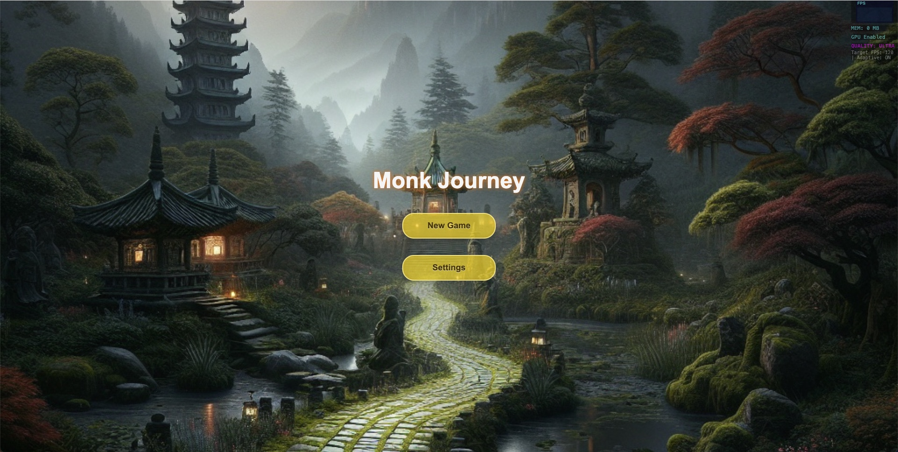
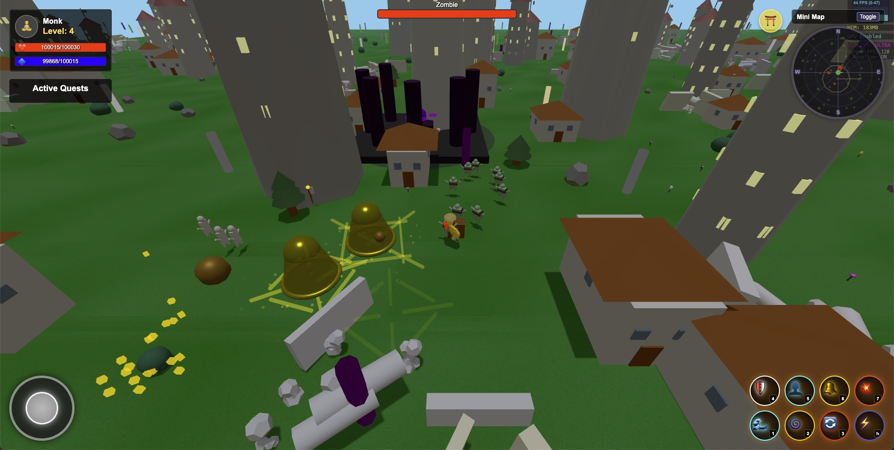
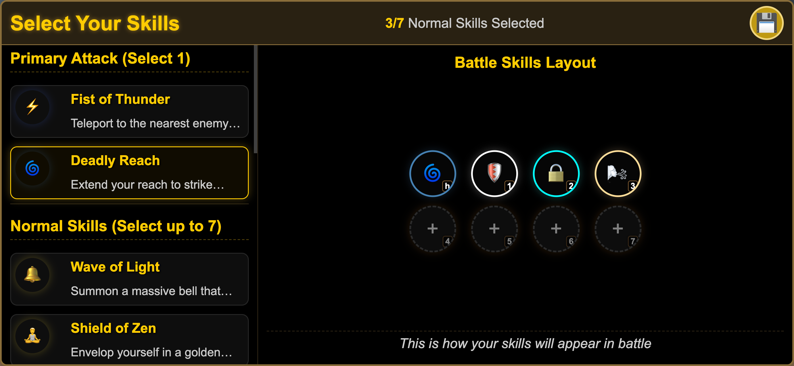
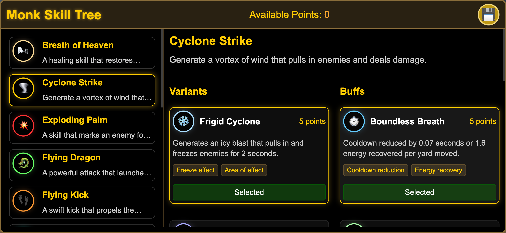
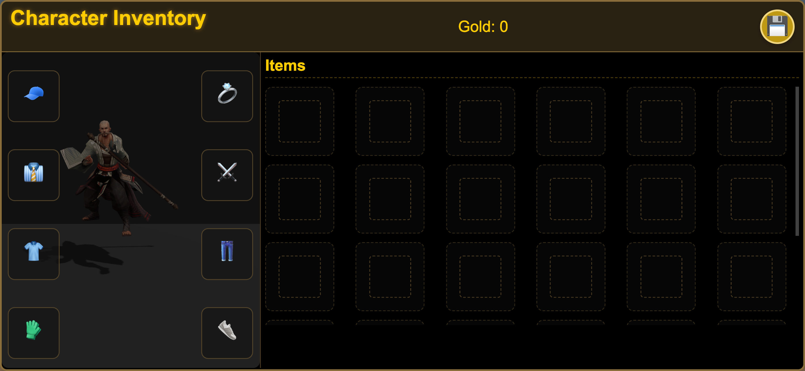
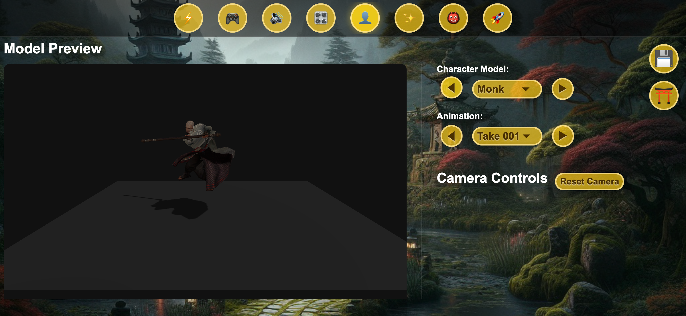
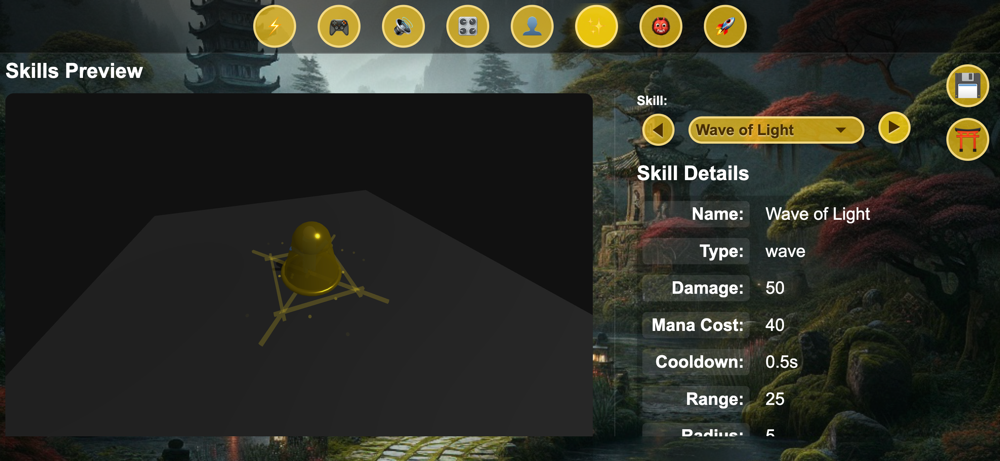
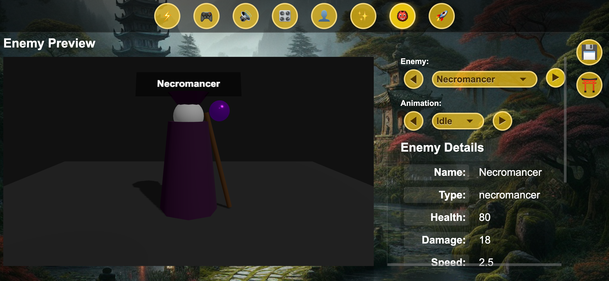
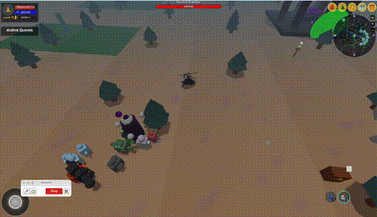
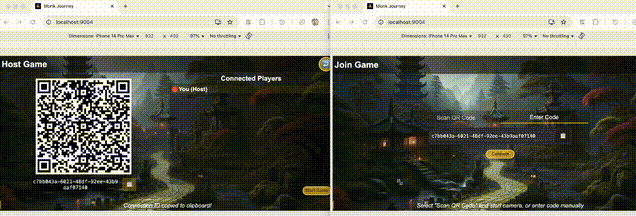

# Monk Journey

## Overview

Monk Journey is an action RPG game where you play as a monk with powerful martial arts abilities. Navigate through procedurally generated terrains, defeat enemies, and master a variety of special skills to become the ultimate warrior monk.

### Skill Selection

### Skill Tree

### Inventory

### Model Preview

### Skill Preview

### Enemy Preview

### Orbit Control

### Multi Player

## Features

- **Powerful Monk Skills**: Master abilities like Wave Strike, Cyclone Strike, Seven-Sided Strike, and Inner Sanctuary
- **Procedurally Generated World**: Explore an endless, dynamically created landscape
- **Engaging Combat**: Fast-paced action with responsive controls
- **Character Progression**: Level up your monk and improve your abilities
- **Performance Optimization**: Adaptive quality settings for smooth gameplay on various devices

## Controls

- **WASD**: Move character
- **1-7**: Use skills

## Installation

1. Clone the repository
2. Open `index.html` in a modern web browser
3. No additional installation required - the game runs directly in your browser!

## Development

Monk Journey is built using:
- Three.js for 3D rendering
- JavaScript for game logic
- HTML5 and CSS for UI elements

## Credits

Developed with passion by the Monk Journey team.

## License

All rights reserved. This project is proprietary and confidential.
